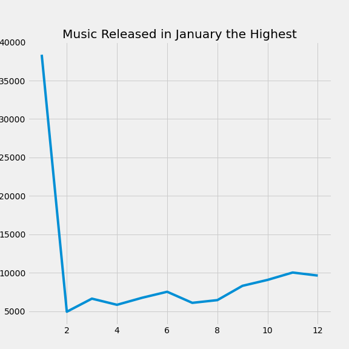
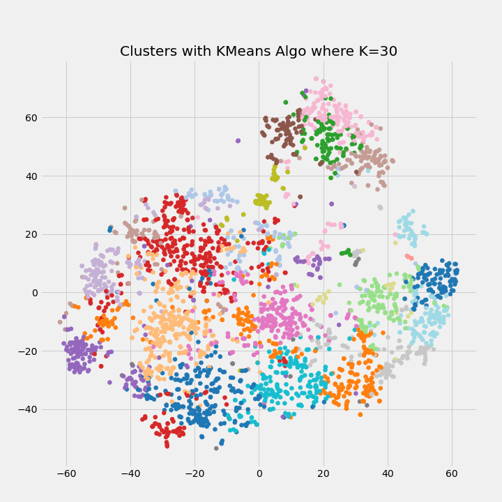

# Spotify Recommender System

## Problem Statement
When engaging with content in our model world, corporations use recommender system to suggest future content we might like based on the attributes of the content. Be it movies or books that we may be interested in with the goal of keeping customer interested. However this may cause an echo chamber effect.

An extreme example of an echo chamber caused by recommender system is youtube's algorithm suggesting alt-right content which may lead to an individual developing extremist views. And this a problem of overtraining, because what is recommended is based on the data that is inputed to the system.

Spotify uses a common method for producing recommendations known as collaborative filtering which generates recommendations based on the combined preferences of the consumer requesting recommendations and those of other consumers. The underlying issue with this method is that song recommendations are based on the 'crowd'.

Furthermore, as the business model of Spotify is built in a way where artists are compensated by number of streams, the homogenisation of new music become more prevalent. Such as making songs more catchier and shorter.

The recommender system I would like to propose is for users to be recommended songs based on the 'DNA' of the music they have been listening to with the goal of potentially exposing the listener to songs form different genres and epochs. This is therefore a cluster or nearest neighbour recommendation system. This would broaden the horizon of music listeners and also bring attention to artists that create music as an artform as opposed to achieving the highest streaming numbers.

## Data Dictionary

There were 2 datasets that were used from Kaggle, 'data_o' and 'data_by_year_o'.

|variable                 |datatype     |description |
|:---|:---|:-----------|
|id                 |object | Song unique ID|
|name               |object | Song Name|
|artist             |object | Song Artist|
|popularity         |int64    | Song Popularity (0-100) where higher is better |
|danceability             |float64  | Danceability describes how suitable a track is for dancing based on a combination of musical elements including tempo, rhythm stability, beat strength, and overall regularity. A value of 0.0 is least danceable and 1.0 is most danceable. |
|energy                   | float64  | Energy is a measure from 0.0 to 1.0 and represents a perceptual measure of intensity and activity. Typically, energetic tracks feel fast, loud, and noisy. For example, death metal has high energy, while a Bach prelude scores low on the scale. Perceptual features contributing to this attribute include dynamic range, perceived loudness, timbre, onset rate, and general entropy. |
|key                      |int64    | The estimated overall key of the track. Integers map to pitches using standard Pitch Class notation . E.g. 0 = C, 1 = C♯/D♭, 2 = D, and so on. If no key was detected, the value is -1. |
|loudness                 |float64    | The overall loudness of a track in decibels (dB). Loudness values are averaged across the entire track and are useful for comparing relative loudness of tracks. Loudness is the quality of a sound that is the primary psychological correlate of physical strength (amplitude). Values typical range between -60 and 0 db.|
|mode                     |int64  | Mode indicates the modality (major or minor) of a track, the type of scale from which its melodic content is derived. Major is represented by 1 and minor is 0.|
|speechiness              |float64    | Speechiness detects the presence of spoken words in a track. The more exclusively speech-like the recording (e.g. talk show, audio book, poetry), the closer to 1.0 the attribute value. Values above 0.66 describe tracks that are probably made entirely of spoken words. Values between 0.33 and 0.66 describe tracks that may contain both music and speech, either in sections or layered, including such cases as rap music. Values below 0.33 most likely represent music and other non-speech-like tracks. |
|acousticness             |float64   | A confidence measure from 0.0 to 1.0 of whether the track is acoustic. 1.0 represents high confidence the track is acoustic.|
|instrumentalness         |float64   | Predicts whether a track contains no vocals. “Ooh” and “aah” sounds are treated as instrumental in this context. Rap or spoken word tracks are clearly “vocal”. The closer the instrumentalness value is to 1.0, the greater likelihood the track contains no vocal content. Values above 0.5 are intended to represent instrumental tracks, but confidence is higher as the value approaches 1.0. |
|liveness                 |float64    | Detects the presence of an audience in the recording. Higher liveness values represent an increased probability that the track was performed live. A value above 0.8 provides strong likelihood that the track is live. |
|valence                  |float64    | A measure from 0.0 to 1.0 describing the musical positiveness conveyed by a track. Tracks with high valence sound more positive (e.g. happy, cheerful, euphoric), while tracks with low valence sound more negative (e.g. sad, depressed, angry). |
|tempo                    |float64    | The overall estimated tempo of a track in beats per minute (BPM). In musical terminology, tempo is the speed or pace of a given piece and derives directly from the average beat duration. |
|duration_ms              |int64   | Duration of song in milliseconds |

## Executive Summary

## Data Cleaning

While checking for duplicates in terms of artist and song name, a duplicate can be a remastered version of the first released song. By definition, remastering music is essentially improving on the quality of the original copy of a song or album. Removing flaws from the music, providing a cleaner, sharper and more refined listening experience whilst trying to bringing the music up to date with current standard. After remastering, certain attributes of the song would still generally remain the same, such as key, time signature, duration, tempo and speechiness. Nonetheless these duplicates would not be remove them, as there are some music enthusiast that actually preferred 'non tampered' music.

However I would remove songs that are duplicates where they have the same exact, values in terms of audio features. These are songs that appear multiple times in different albums, but had different IDs or different popularity scores. For example the song 'Here Comes the Sun' had a lower popularity score from the album 'The Beatles 1967-1970' whereas the song with the higher popularity had belonged to the album 'Abbey Road (remastered)' where its a bigger compilation of classics by the band.

The longest song duration in the dataset shows to be 90 minutes long. These are likely to be podcast are maybe comedy albums that comedians have put out. Or could also be audio of soundscapes people use for mediation. Ultimately for this project, with the knowledge that most songs tend to be under 10 minutes. I would remove all songs that exceed this duration.

Reformatting of string in object columns had also been done to remove symbols and separating main artist and featuring artist.

## Exploratory Data Analysis

Shorter duration in songs shows that artist are incentivised to make shorter songs for more plays as they are paid per stream.

Furthermore songs tend to be more popular, past the 50 mark, with shorter duration.

Loudness, the inherent volume of the music itself, before any adjustments by the listener.

What this shows is dynamic range becomes much more restricted. As in, the contrast between the really soft stuff, and the really loud stuff shrinks, so the overall emotional impact of the music is reduced.

Key or pitch include details about harmony, melody, chords, and progressions – essentially how the notes were arranged and unfolded over the course of the song.

Data suggested that the variety of pitch progressions used has shrunk over the years. In other words, musicians are becoming less inventive and adventurous in how they get from one note or chord to the next, and instead seem to be relying more and more on the same sequences and patterns that others have used successfully in the past.

Generally, the first two months of the year are a great time to release new music. Why? The market isn't as saturated as later on in the year, and the minds of listeners are open to new things.

## Clustering

### Clustering Genre Together

In this section, data_by_genres_df is used for clustering to see how the different genres would be clustered together based on their average song attributes, using different clustering methods.

By using this dataset, we can see the different kinds of genre you could expect from a given cluster.

### KMeans

Kmeans algorithm is an iterative algorithm that tries to partition the dataset into K pre-defined distinct non-overlapping subgroups (clusters) where each data point belongs to only one group. It tries to make the intra-cluster data points as similar as possible while also keeping the clusters as different (far) as possible.

Before deciding any value of K, we try the elbow method first.

From just using the elbow method, it suggest that 2 cluster is optimal. However just clustering 2973 genres into 2 clusters is not logical, I would therefore give my own K value or look into other clustering methods that makes more sense by just eyeballing it.

The K value that I had is 30. To visualise this on the high dimensional dataset, T-SNE projects it into lower dimensional space.

Visually, the segementation of the data does not appear to be the best. May have to reconsider the clustering algorithm or the number of cluster.

## Recommendations

Implicit
- or get implicit feedback on the number times a user skips recommended suggestion (not the most accurate as clicks can happen by accident)
- what is the ratio of songs added to the playlist against suggested
- the duration of the song you listen to
- how often the song is repeated provided its added into the playlist

Explicit
- have the user for explicit feedback whether they like the recommendation (perceived quality)

### Diferent types of Feature Selection/Extraction

- Using SVD (Singular Vector Decompostion) "Matrix Decomposition"
- Using PCA to select the most important variables

### Metrics

- Unsure if the metric is subject to the listener

### Building the Recommender System
- Naive and non personalised way by recreating the Collab Filtering as a baseline
- using distance to build a recommender system via clustered genres
- Using CNN as a recommender system
    - emulating this research paper https://www.sciencedirect.com/science/article/pii/S1877050919310646/pdf?md5=4f9a5242eb223b5c96c9ebf130855467&pid=1-s2.0-S1877050919310646-main.pd
- using cosine similarity

### Potential Limitations and Considerations

- kaggle dataset does not have user engagement and only genre metadata

 - Show why Collab filtering is not ideal due to the the cold start problem, also suggesting niche recommendation, requires reference from what may be a scare dataset. Generally why collab filtering would create an echo chamber because popularity of the music can be affected exogenous factors such as hype around the artist, your social group and so on.
