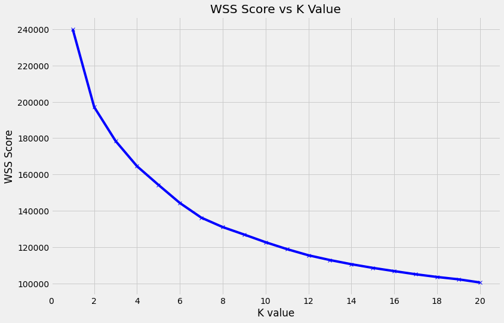

# Spotify Recommender System

## Problem Statement
When engaging with content in our model world, corporations use recommender systems to suggest future content we might like based on the attributes of the content or similar users to keep customers engaged. Unfortunately, this may cause an echo chamber effect.

On the lower end of the spectrum of how harmful the echo chamber effect may be, economically, it may limit the variety of products to which consumers are exposed, limiting a business’s potential to increase product demand. On the other end of the spectrum, users might be recommended fake news or articles that promote bigotry and hate leading to a more divided and divisive society.

Spotify uses a common method for producing recommendations known as collaborative filtering which generates recommendations based on the combined preferences of the consumer and those of other similar consumers. The underlying issue with this method is that song recommendation are based on the 'crowd'.

Furthermore, as the business model of Spotify is built in a way where artists are compensated by the number of streams, the homogenization of new music becomes more prevalent. Such as making songs catchier and shorter.

The recommender system I would like to propose is for users to be recommended songs based on the 'DNA' of the music, its musical attributes, to potentially expose the listener to songs from different genres and epochs.  This would broaden the horizon of music listeners and also bring attention to artists that create music as an art form as opposed to achieving the highest streaming numbers.

## Data Dictionary

2 datasets were used from Kaggle, 'data_o' and 'data_by_year_o'. And 1 dataset, my personal streaming history sent by Spotify.

|variable                 |datatype     |description |
|:---|:---|:-----------|
|id                 |object | Song unique ID|
|name               |object | Song Name|
|artist             |object | Song Artist|
|popularity         |int64    | Song Popularity (0-100) where higher is better |
|danceability             |float64  | Danceability describes how suitable a track is for dancing based on a combination of musical elements including tempo, rhythm stability, beat strength, and overall regularity. A value of 0.0 is least danceable and 1.0 is most danceable. |
|energy                   | float64  | Energy is a measure from 0.0 to 1.0 and represents a perceptual measure of intensity and activity. Typically, energetic tracks feel fast, loud, and noisy. For example, death metal has high energy, while a Bach prelude scores low on the scale. Perceptual features contributing to this attribute include dynamic range, perceived loudness, timbre, onset rate, and general entropy. |
|key                      |int64    | The estimated overall key of the track. Integers map to pitches using standard Pitch Class notation . E.g. 0 = C, 1 = C♯/D♭, 2 = D, and so on. If no key was detected, the value is -1. |
|loudness                 |float64    | The overall loudness of a track in decibels (dB). Loudness values are averaged across the entire track and are useful for comparing relative loudness of tracks. Loudness is the quality of a sound that is the primary psychological correlate of physical strength (amplitude). Values typical range between -60 and 0 db.|
|mode                     |int64  | Mode indicates the modality (major or minor) of a track, the type of scale from which its melodic content is derived. Major is represented by 1 and minor is 0.|
|speechiness              |float64    | Speechiness detects the presence of spoken words in a track. The more exclusively speech-like the recording (e.g. talk show, audio book, poetry), the closer to 1.0 the attribute value. Values above 0.66 describe tracks that are probably made entirely of spoken words. Values between 0.33 and 0.66 describe tracks that may contain both music and speech, either in sections or layered, including such cases as rap music. Values below 0.33 most likely represent music and other non-speech-like tracks. |
|acousticness             |float64   | A confidence measure from 0.0 to 1.0 of whether the track is acoustic. 1.0 represents high confidence the track is acoustic.|
|instrumentalness         |float64   | Predicts whether a track contains no vocals. “Ooh” and “aah” sounds are treated as instrumental in this context. Rap or spoken word tracks are clearly “vocal”. The closer the instrumentalness value is to 1.0, the greater likelihood the track contains no vocal content. Values above 0.5 are intended to represent instrumental tracks, but confidence is higher as the value approaches 1.0. |
|liveness                 |float64    | Detects the presence of an audience in the recording. Higher liveness values represent an increased probability that the track was performed live. A value above 0.8 provides strong likelihood that the track is live. |
|valence                  |float64    | A measure from 0.0 to 1.0 describing the musical positiveness conveyed by a track. Tracks with high valence sound more positive (e.g. happy, cheerful, euphoric), while tracks with low valence sound more negative (e.g. sad, depressed, angry). |
|tempo                    |float64    | The overall estimated tempo of a track in beats per minute (BPM). In musical terminology, tempo is the speed or pace of a given piece and derives directly from the average beat duration. |
|duration_ms              |int64   | Duration of song in milliseconds |

## Executive Summary

## Data Cleaning

While checking for duplicates in terms of artist and song name, a duplicate can be a remastered version of the first released song. By definition, remastering music is essentially improving the quality of the original copy of a song or album. Removing flaws from the music, providing a cleaner, sharper, and more refined listening experience whilst trying to bringing the music up to date with the current standard. After remastering, certain attributes of the song would still generally remain the same, such as key, time signature, duration, tempo, and speechiness. Nonetheless, these duplicates would not remove them, as there are music enthusiasts that prefer 'non tampered' music.

However, songs that are duplicates where they have the same values in terms of audio features would be removed. These are songs that appear multiple times in different albums but had different IDs or different popularity scores. For example, the song 'Here Comes the Sun' had a lower popularity score from the album 'The Beatles 1967-1970' whereas the song with the higher popularity had belonged to the album 'Abbey Road (remastered)' where its a bigger compilation of classics by the band.

The longest song duration in the dataset shows to be 90 minutes long. These are likely to be podcasts are maybe comedy albums that comedians have put out. Or could also be audio of soundscapes people use for mediation. Ultimately for this project, with the knowledge that most songs tend to be under 10 minutes. I would remove all songs that exceed this duration.

Reformatting of string in object columns had also been done to remove symbols and separating the main artist and featuring artists.

## Exploratory Data Analysis

As the years pass, music has been mastered to be louder. When a song is produced to be inherently loud, the dynamic range becomes much more restricted. Meaning the fidelity of the song is compromised and can even reduce the overall emotional impact of the music.

It has been a recent trend in Standard Operating Procedure where mastering music has been to make the finished, mastered track as loud as possible.

The idea is that louder tracks will grab the listener’s attention and lead to a greater number of downloads and if a track is noticeably softer l than other songs in a playlist or on the radio, and this may result in the listener having a subconscious negative impression of the song.

Key or pitch include details about harmony, melody, chords, and progressions – essentially how the notes were arranged and unfolded throughout the song.

The above trend suggested that the variety of pitch progressions used has shrunk over the years. In other words, musicians are becoming less inventive and adventurous in how they progress from one note or chord to the next, and instead, seem to be relying more on the same sequences and patterns that others have used successfully in the past.

We also see a gradual decrease in song duration until 2011, and then a sharp decline after. This was the year where Spotify had started its streaming services.

Spotify would only payout to artists after a certain amount of a song has been played. As a result, the average length of a song intro has decreased from over 20 seconds in the ’80s to less than 5 now. This suggests that artists are incentivized to make shorter songs for more plays as they are paid per stream.

### The 'Spotify Sound'

With such an abundance of music available, it has become very competitive for artists to grab the listeners' attention.

Additionally, data suggest we are far less likely to skip a track we’ve heard before.
As a result, it is now common for tracks to feature the hook, guest artist, or a prominent sample in the first few seconds contributing to a phenomenon known as the “Spotify sound”, something that artists are paying a lot to try to procure.

This method of songwriting and production has also considered being a proven blueprint for creating a hit song. As a result, given the above trends and Spotify business model, chart music is becoming more homogenized.

### Content-Based as a Solution

As the boundaries of music are fluid and it is difficult to define a genre by only its audio features, I believe that a content-based recommender that recommends music based only on audio features would recommend music from different genres, epochs, and languages.

The user would be presented with opportunities to be exposed to different types of music and broaden their music listening horizons, preventing the echo chamber effect. In contrast with being recommended songs based on what's popular or what other people are listening which tends to be chart music which has contributed to the homogenization of music.

 

The Long Tail coined by Chris Anderson describes the idea that the internet affects the types of products being sold that produce the majority of the revenue, such that selling a large amount of niche product is becoming more important to the sales of companies.

However with social media and algorithm-driven recommendations (collaborative filtering), including Spotify’s own generated playlists, seem to magnify the bandwagon effect, whereby popular songs become even more popular.

The content-based recommender aims to draw more recommendations along the Long Tail and hopefully create more demand in niche genres, artists, or songs. Thus, encouraging the creation of music that would not inevitably sound the same, as artists would be less incentivized to ‘sell-out’.

## Metrics

As this is a content-based recommender and there is no user data to compare predicated recommendations with similar user ratings using RMSE score, metrics would therefore have to be qualitative.

### Diversity

Diversity measures how narrow or wide the spectrum of recommended products is. A recommender that only recommends the music of one artist is considered to be narrow while one that recommends across multiple artists is considered to be more diverse.

The following questions fall under how diverse the recommendations are:
- Are different genres recommended?
- Are different languages recommended?
- Are songs from different eras recommend?

If the answer to these questions is 'yes' then we would satisfy the Diversity metric.

### Novelty

Novelty measures how new, original, or unusual the recommendations are for the user.

In general, recommenders tend to generate recommendations that consist of popular items, or in this case songs, as most users tend to engage with popular items. This would translate to a low Novelty score.

The content-based recommender is to generate unique recommendations, aligned to recommend more niche artists, songs, or genres. Thus aiming to have a high Novelty score.

## Validating Intuition

One of the limitations of content-based recommender, as with others, that it is still known to create a filter bubble. However, because we are recommending based on just audio features, recommendations may not be the same genre, epoch, or language.

How we can prove this is by clustering the song data.

### Visualising the data

To visualize our data, we use t-Distributed Stochastic Neighbor Embedding (t-SNE). t-SNE reduces high dimension data while preserving information on local similarities, trying to preserve the neighborhood of the respective data points which give a feel or intuition of how the data lives in a given feature space.

Intuitively we can see that there are some clusters. Based on the globular shape of the t-SNE results, we can expect KMeans to perform well.

### KMeans Clustering

The Kmeans algorithm partitions the dataset into K pre-defined distinct non-overlapping subgroups (clusters) where each data point belongs to only one group. It tries to make the intra-cluster data points as similar as possible while also keeping the clusters as different (far) as possible.

To deciding the value of K, we use the elbow method.

The total WSS (Within-Cluster-Sum of Squared Errors) score measures the compactness of the clustering. We want it to be as small as possible. The Elbow method looks at the total WSS as a function of the number of clusters. The best value of K clusters is where by adding another cluster, it does not significantly improve the total WSS score.

From the above graph, we see that the elbow is at K =8.  where the WSS Score starts decreasing linearly. Thus for the given data, we can conclude that the optimal number of clusters for the data is 8.

### Analyzing where Johann Sebastien Bach falls

Johann Sebastien Bach, a famous composer of classical music, when his songs are clustered based on only audio features, we see a clear tendency for his music to fall under Cluster 1. Yet some songs can still be found under other clusters.

This is indicative that the boundaries of music are fluid, and songs from different genres would exist as neighbors in a given feature space.

## Building a Top N Content-Based Recommender using Cosine Similarity

Even though we can predict there may be different types of genre within a cluster and therefore among the neighbors of a given song, the algorithm of choice will still be cosine similarity.

Cosine similarity does not consider magnitude in its similarity measurement unlike euclidean distance in a K Nearest Neighbour Recommender. Therefore, in theory, using Cosine Similarity should result in recommendations from different clusters and therefore different genres.

The three songs that were used to compare recommendations are:

- Ice Ice Baby by Vanilla Ice (1990)
- All of Me by John Legend (2016)
- Mr. Brightside by The Killers (2004)

These songs were selected as they are fairly popular and recognizable as well as being songs from different genres and eras.

### Evaluating the top 5 Recommendations

#### Ice Ice Baby by Vanilla Ice

|Artist               |Song    |Year | Language | Genre |
|:---|:---|:-----------|:-----|:-----|
|Tom Tom Club|Genius of Love|1981|English|Rock
|Fern Kinney|Groove Me|1979|English|Electronic
|Mellow Man Ace|Mentirosa|1989|English|Hip Hop
|Whodini|Mentirosa|1986|English|Hip Hop
|M.C. Luscious|Growing Up|1992|English|Hip Hop

#### All of Me by John Legend

|Artist               |Song    |Year | Language | Genre |
|:---|:---|:-----------|:-----|:-----|
|Rosemary Clooney|Snow|1954|English|traditional pop
|Martina McBride|In My Daughter's Eyes|2003|English|Country
|Irma Serrano|Canción de un Preso|1962|Spanish|Latin pop
|Emeli Sandé|Clown|2012|English|Gospel
|Fairuz|Baadak Ala Baly|1963|Arabic|Folk

#### Mr Brightside by The Killers  

|Artist               |Song    |Year | Language | Genre |
|:---|:---|:-----------|:-----|:-----|
|Taking Back Sunday|My Blue Heaven|2006|English|Alternative/Indie
|Adema|Giving In|2001|English|Rock
|Scorpions|Under the Same Sun|1993|English|Rock
|Sex Pistols|Liar|1977|English|Alternative/Indie
|Oasis|Don't Look Back In Anger|1995|English|Britpop

We can see that the current recommender satisfies the diversity metric as songs recommended are from different genres, languages, and epochs. However, in terms of novelty, the score would be rather high as the recommendations are very unfamiliar songs. This raises the problem of whether the recommender is trustworthy. Not only would other users perceive the recommendations to be random, but the recommendations are not tailored to their specific tastes.

Thus, to personalize the recommender, I have decided to use my streaming history data to reduce the perceived randomness.

## Personalizing the Recommender

### Feature Engineering

Spotify allows you to download your streaming data from its website directly. After a few days, you would receive a zip folder of your listening history in j.son format. The data is sorted by song and the duration you listen to a particular song per listening session. After using a groupby function on the artist and song, you would get the total duration you would have listened to a song, under the 'msPlayed'.

3909 out of 8749 songs from my streaming history data were then merged onto the Kaggle dataset on the 'main_aritst' and 'song' column. from these 3909 songs, listen counts could then be calculated by dividing the 'msPlayed' column by the 'duration_ms' columns.

### Creating a Target variable

Based on the histogram plotted against the 3909 songs, I can conclude that 10 is the number of times I listened to a song to be considered a 'favorite'. Songs with 10 listens and greater would therefore be labeled with a 1, and the others will be labeled with a 0.

These 3909 songs with their respective classes will be the dataset to train our classification models on, and the best model will be used to predict potential favorite songs from the Kaggle dataset that I have yet to listen to.

### Using Ensembled Methods for classification

Ensemble methods are techniques that create multiple models and then combine them to produce improved results. Ensemble methods usually produce more accurate solutions than a single model would. This has been the case in several machine learning competitions, where the winning solutions used ensemble methods.

Therefore the three models that were selected for this project are Random Classifier, Adaboost, and XGBoost.

### Handling Imbalance Classes

Before training our models, we have to address that the dataset is highly imbalanced, with approximately 7% of the dataset being the target. This may result in our models having poor predictive performance, especially for the minority class.

Therefore we will use SMOTE, Synthetic Minority Over-Sampling Technique, which joins the points of the minority class with line segments and then placing artificial points on these lines. This is to ensure that our train test split does not undersample our minority class.

### Evaluating the models

If our model were to classify every song as not a favorite, we would have an accuracy of 93%. This is the baseline score to beat in terms of accuracy. But ultimately, model selection will be based on Precision (Positive Predictive Value) as there is a low cost associated with False Negative predictions.

|Model               |Accuracy (test set)  |Precision|
|:---|:---|:-----------|
Baseline| 93.2%| - |
Random Forest| 93.4%|91.4%|
Gradient Boost|97.3%|92.9%|
XGBoost|94.6%|95.1%|

All Models had performed better in terms of accuracy compared to baseline, however, XGBoost perform the best in terms of precision.

### Creating a Personalized Dataset

The Kaggle dataset which only had songs that I have not listen to before was saved as 'test_df'.  XGBoost was then used on test_df to predict songs that I might enjoy and classify them as 1, otherwise, it would be classified as 0. This dataframe was then filtered to only have songs classified as 1 and then merged with the streaming history data where favourite songs also classified as 1 had also been filtered. This new dataframe,  with only songs that had been predicted to be enjoyed by me and already enjoy, consists of 24269 songs compared to the initial dataframe of 155098 songs which had included songs without any prediction of possibly being enjoyed.

### Evaluating the top 5 Personalized Recommendations

#### Ice Ice Baby by Vanilla Ice

|Artist               |Song    |Year | Language | Genre |
|:---|:---|:-----------|:-----|:-----|
|The Format|On Your Porch|2003|English|Rock
|The Supremes|Stop! In the Name of Love|1965|English|Soul
|Keith Jarrett|The Rich|1974|-|Jazz
|Buddy Holly|(Umm, Oh Yeah), Dearest|1964|English|Jazz
|Los Enanitos|Luz De Dia|1999|English|Pop

#### All of Me by John Legend

|Artist               |Song    |Year | Language | Genre |
|:---|:---|:-----------|:-----|:-----|
|A Tribe Called Quest|God Lives Through|1993|English|Hip Hop
|Brand Nubian|Punks Jump Up to Get Beat Down|1993|English|Hip Hop
|Cypress Hill|Siempre Peligroso (feat. Fermin IV Caballero)|1999|Spanish|Hip Hop
|Khalid|Location|2017|English|R & B
|Slum Village|Count The Ways|2004|English|Hip Hop

#### Mr Brightside by The Killers

|Artist               |Song    |Year | Language | Genre |
|:---|:---|:-----------|:-----|:-----|
|Makano|Dejame Entrar|2008|English|Reggaeton
|LA INDIA|Sedúceme - Salsa Version|2002|Spanish|Pop
|Los Ángeles Azules|Mis Sentimientos|2015|Spanish|Regional Mexican
|El Gran Combo De Puerto Rico|Compañera Mía|1982|Spanish|Pop
|Anuel AA|Keii|2020|Spanish|Latin Trap

We can see that as a personalized recommender,  still satisfies the diversity metric. However, what was observed is there the variety of genres in the recommendations based on John Legend's song was low with most of it being Hip Hop.  

In terms of novelty, I do recognize some of these artists, such as Cypress Hill, Khalid, and A Tribe Called Quest just to name a few. Despite these familiar artists, more than half of the recommendations are still rather foreign. Nonetheless, the recommenders' novelty score is lower (what we had aimed to do) compared to the previous version.

I had also listened to these song recommendations and I had enjoyed most of them. Ultimately, it is still uncertain to say if this recommender is trustworthy or would do well with an average user.

## Improving the Recommender

Lastly, up until this section, the focus had been on recommendations based on one seed song. To improve the recommender further, should a user decide to make a playlist, weights would be added to older songs in a playlist to account for recency bias. Assuming that new songs added to a playlist are a reflection of a person's current taste in music, older songs of the playlist would be multiplied by weights that make its "vote" smaller. The average of all the songs in the playlist after being multiplied by their corresponding weights would then be used to recommend the next song.

## Conclusion

- More for Passive listeners
- Would only know it will work with A/B testing

## Recommendation

- How can I make a playlist more cohesive
- NLP on lyrics
- Play around with features, like valence
