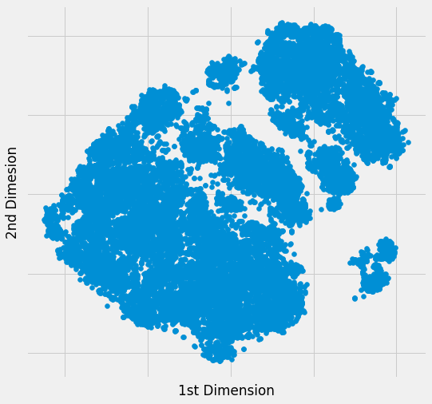
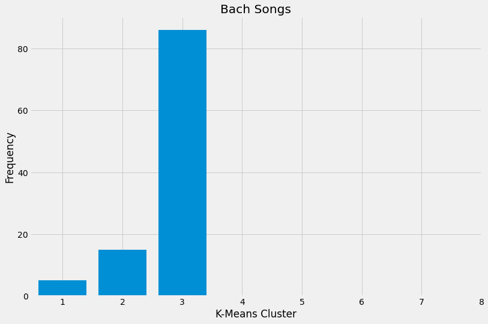

# Spotify Recommender System

## Problem Statement
When engaging with content in our model world, corporations use recommender system to suggest future content we might like based on the attributes of the content. Be it movies or books that we may be interested in with the goal of keeping customer interested. However this may cause an echo chamber effect.

An extreme example of an echo chamber caused by recommender system is youtube's algorithm suggesting alt-right content which may lead to an individual developing extremist views. And this a problem of overtraining, because what is recommended is based on the data that is inputed to the system.

Spotify uses a common method for producing recommendations known as collaborative filtering which generates recommendations based on the combined preferences of the consumer requesting recommendations and those of other consumers. The underlying issue with this method is that song recommendations are based on the 'crowd'.

Furthermore, as the business model of Spotify is built in a way where artists are compensated by number of streams, the homogenisation of new music become more prevalent. Such as making songs more catchier and shorter.

The recommender system I would like to propose is for users to be recommended songs based on the 'DNA' of the music they have been listening to with the goal of potentially exposing the listener to songs form different genres and epochs.  This would broaden the horizon of music listeners and also bring attention to artists that create music as an artform as opposed to achieving the highest streaming numbers.

## Data Dictionary

There were 2 datasets that were used from Kaggle, 'data_o' and 'data_by_year_o'.

|variable                 |datatype     |description |
|:---|:---|:-----------|
|id                 |object | Song unique ID|
|name               |object | Song Name|
|artist             |object | Song Artist|
|popularity         |int64    | Song Popularity (0-100) where higher is better |
|danceability             |float64  | Danceability describes how suitable a track is for dancing based on a combination of musical elements including tempo, rhythm stability, beat strength, and overall regularity. A value of 0.0 is least danceable and 1.0 is most danceable. |
|energy                   | float64  | Energy is a measure from 0.0 to 1.0 and represents a perceptual measure of intensity and activity. Typically, energetic tracks feel fast, loud, and noisy. For example, death metal has high energy, while a Bach prelude scores low on the scale. Perceptual features contributing to this attribute include dynamic range, perceived loudness, timbre, onset rate, and general entropy. |
|key                      |int64    | The estimated overall key of the track. Integers map to pitches using standard Pitch Class notation . E.g. 0 = C, 1 = C♯/D♭, 2 = D, and so on. If no key was detected, the value is -1. |
|loudness                 |float64    | The overall loudness of a track in decibels (dB). Loudness values are averaged across the entire track and are useful for comparing relative loudness of tracks. Loudness is the quality of a sound that is the primary psychological correlate of physical strength (amplitude). Values typical range between -60 and 0 db.|
|mode                     |int64  | Mode indicates the modality (major or minor) of a track, the type of scale from which its melodic content is derived. Major is represented by 1 and minor is 0.|
|speechiness              |float64    | Speechiness detects the presence of spoken words in a track. The more exclusively speech-like the recording (e.g. talk show, audio book, poetry), the closer to 1.0 the attribute value. Values above 0.66 describe tracks that are probably made entirely of spoken words. Values between 0.33 and 0.66 describe tracks that may contain both music and speech, either in sections or layered, including such cases as rap music. Values below 0.33 most likely represent music and other non-speech-like tracks. |
|acousticness             |float64   | A confidence measure from 0.0 to 1.0 of whether the track is acoustic. 1.0 represents high confidence the track is acoustic.|
|instrumentalness         |float64   | Predicts whether a track contains no vocals. “Ooh” and “aah” sounds are treated as instrumental in this context. Rap or spoken word tracks are clearly “vocal”. The closer the instrumentalness value is to 1.0, the greater likelihood the track contains no vocal content. Values above 0.5 are intended to represent instrumental tracks, but confidence is higher as the value approaches 1.0. |
|liveness                 |float64    | Detects the presence of an audience in the recording. Higher liveness values represent an increased probability that the track was performed live. A value above 0.8 provides strong likelihood that the track is live. |
|valence                  |float64    | A measure from 0.0 to 1.0 describing the musical positiveness conveyed by a track. Tracks with high valence sound more positive (e.g. happy, cheerful, euphoric), while tracks with low valence sound more negative (e.g. sad, depressed, angry). |
|tempo                    |float64    | The overall estimated tempo of a track in beats per minute (BPM). In musical terminology, tempo is the speed or pace of a given piece and derives directly from the average beat duration. |
|duration_ms              |int64   | Duration of song in milliseconds |

## Executive Summary

## Data Cleaning

While checking for duplicates in terms of artist and song name, a duplicate can be a remastered version of the first released song. By definition, remastering music is essentially improving on the quality of the original copy of a song or album. Removing flaws from the music, providing a cleaner, sharper and more refined listening experience whilst trying to bringing the music up to date with current standard. After remastering, certain attributes of the song would still generally remain the same, such as key, time signature, duration, tempo and speechiness. Nonetheless these duplicates would not be remove them, as there are some music enthusiast that actually preferred 'non tampered' music.

However songs that are duplicates where they have the same exact, values in terms of audio features would be removed. These are songs that appear multiple times in different albums, but had different IDs or different popularity scores. For example the song 'Here Comes the Sun' had a lower popularity score from the album 'The Beatles 1967-1970' whereas the song with the higher popularity had belonged to the album 'Abbey Road (remastered)' where its a bigger compilation of classics by the band.

The longest song duration in the dataset shows to be 90 minutes long. These are likely to be podcast are maybe comedy albums that comedians have put out. Or could also be audio of soundscapes people use for mediation. Ultimately for this project, with the knowledge that most songs tend to be under 10 minutes. I would remove all songs that exceed this duration.

Reformatting of string in object columns had also been done to remove symbols and separating main artist and featuring artist.

## Exploratory Data Analysis

Loudness, the inherent volume of the music itself, before any adjustments by the listener.

As the years pass, music have been mastered to be louder. When a song is produced to be inherently loud, the dynamic range becomes much more restricted. Meaning the fidelity of the song is compromised and can even reduce the overall emotional impact of the music.

For many years now, Standard Operating Procedure when mastering music has been to make the finished, mastered track as loud as possible.

The idea is that louder tracks will grab the listener’s attention and lead to greater downloads, and if a track is noticeably softer l than other songs in a playlist or on the radio, and this may result in the listener having a subconscious negative impression of the song.

Key or pitch include details about harmony, melody, chords, and progressions – essentially how the notes were arranged and unfolded over the course of the song.

The above trend suggested that the variety of pitch progressions used has shrunk over the years. In other words, musicians are becoming less inventive and adventurous in how they get from one note or chord to the next, and instead seem to be relying more and more on the same sequences and patterns that others have used successfully in the past.

We see a gradual decrease in song duration until 2011, and then a sharp decline after. This when Spotify had started its streaming services.

Spotify would only pay out after a certain amount of a song has been played. As a result, the average length of a song intro has decreased from over 20 seconds in the 80’s to less than 5 now. This shows that artist are incentivised to make shorter songs for more plays as they are paid per stream.

### The 'Spotify Sound'

With such an abundance of music available, it has become very competitive got artist to grab the listeners attention.

Additionally, data suggest we are far less likely to skip a track we’ve heard before.
As a result, it is now common for tracks to feature the hook, guest artist or a prominent sample in the first few seconds contributing to a phenomenon known as the “Spotify sound”, something that artists are paying a lot to try procure.

This method of song writing and production has also considered to be a a proven blueprint for creating a hit song,

As a result, given the above trends and Spotify business model, chart music is becoming more homogenized.

### Content Based as a Solution

With a content based recommender that recommends music based only on audio feature, it is expected that music from different genres, epochs and languages would be recommended.

The user would be presented an opportunity be exposed to different types of music to broaden their music listening horizons as opposed to being recommended songs based on what's popular or what other people are listening that tend to be chart music, therefore preventing the echo chamber effect and the homogenization of music.

 

In theory, the Long Tail coined by Chris Anderson describes the idea that the internet affects the types of products being sold that produce the majority of the revenue, such that selling a large amount of niche product is becoming more important to the sales of companies

However with social media and algorithm-driven recommendations (collaborative filtering), including Spotify’s own playlists, seem to magnify the bandwagon effect, whereby popular songs become even more popular by virtue of their popularity.

Hopefully this recommender would draw more recommendations along the Long Tail where and hopefully create more demand in niche genres, artist or songs. Thus, encourage the creation of music that would not inevitably sound the same, as artist would be less incentivised to ‘sell out’.

## Metrics

As this is a content based recommender and there is no user data to compare predicated recommendations with similar user ratings using RMSE score, metrics would therefore have to be qualitative.

### Diversity

Diversity measures how narrow or wide the spectrum of recommended products are. A recommender that only recommends the music of one artiste is pretty narrow; one that recommends across multiple artistes is more diverse.

The following questions fall under how we diverse the recommendations are:
- Are different genres recommended?
- Are different languages recommended?
- Are songs from different eras recommend?

If the answer to these questions, are 'yes' then we would satisfy the Diversity metric.

### Novelty

Novelty measures how new, original, or unusual the recommendations are for the user.

In general, recommenders tend to create recommendations that consist of popular items, or in this case songs, as most user tend to engage with popular items and therefore having more data (as we learnt that recommendations are not commonly derived from the 'Long Tail') and these popular items do well in offline and online evaluations.

The content base recommender's goal is to ensure that recommendations are not popular to align with the objective of recommending more niche artist, songs or genre.

## Building the Recommender

One of the limitations of content based recommendations, as with others, that it is still known to create a filter bubble. However because the content we are recommending is music based on just audio features, there is still a possibility for recommendations to not be the same genre, epoch or language.

How we can prove this is by clustering the song data.

### Visualising the data

To visualise our data, we use t-Distributed Stochastic Neighbor Embedding (t-SNE). t-SNE reduces high dimension data while preserving information on local similarities, trying to preserve the neighbourhood of the respective data points which give a feel or intuition of how the data lives in a given feature space.

Intuitively we can see that there are some clusters. Based on the globular shape of the t-SNE results, we can expect KMeans to perform well.

### KMeans Clustering

Kmeans algorithm is an iterative algorithm that tries to partition the dataset into K pre-defined distinct non-overlapping subgroups (clusters) where each data point belongs to only one group. It tries to make the intra-cluster data points as similar as possible while also keeping the clusters as different (far) as possible.

Before deciding any value of K, we try the elbow method first.

The total WSS (Within-Cluster-Sum of Squared Errors) measures the compactness of the clustering and we want it to be as small as possible. The Elbow method looks at the total WSS as a function of the number of clusters: One should choose a number of clusters so that adding another cluster doesn’t improve much better the total WSS.

From the above graph we see that the elbow is at K =8.  where the WSS Score start decreasing in a linear fashion. Thus for the given data, we can conclude that the optimal number of clusters for the data is 8.

### Analyzing where Johann Sebastien Bach falls

Johann Sebastien Bach, a famous composer of classical music, when his songs are clustered based on only audio features, we see a clear tendency for his music to fall under Cluster 1 while some songs can still be found in under clusters.

This is indicative that the boundaries of music are fluid, and songs from different genres would be neighbours in a given feature space.

## Building a Top N Content Based Recommender using Cosine Similarity

Even though we can predict there may be different types of genre within a cluster, the algorithm of choice will still be cosine similarity instead of of using a pairwise distance metric.

Cosine similarity does not consider magnitude in its similarity measurement unlike euclidean distance in a K Nearest Neighbour Recommender. In theory, using Cosine Similarity should result in recommendations from different clusters and therefore different genre.

The three songs that were used to compare recommendations on are:

- Ice Ice Baby by Vanilla Ice (1990)
- All of Me by John Legend (2016)
- Mr Brightside by The Killers (2004)

These songs were selected as they are fairly popular and recognisable as well as being songs from different genres and eras.

### Evaluating the top 5 Recommendations

#### Ice Ice Baby by Vanilla Ice

|Artist               |Song    |Year | Language | Genre |
|:---|:---|:-----------|:-----|:-----|
|Tom Tom Club|Genius of Love|1981|English|Rock
|Fern Kinney|Groove Me|1979|English|Electronic
|Mellow Man Ace|Mentirosa|1989|English|Hip Hop
|Whodini|Mentirosa|1986|English|Hip Hop
|M.C. Luscious|Growing Up|1992|English|Hip Hop

#### All of Me by John Legend

|Artist               |Song    |Year | Language | Genre |
|:---|:---|:-----------|:-----|:-----|
|Rosemary Clooney|Snow|1954|English|traditional pop
|Martina McBride|In My Daughter's Eyes|2003|English|Country
|Irma Serrano|Canción de un Preso|1962|Spanish|Latin pop
|Emeli Sandé|Clown|2012|English|Gospel
|Fairuz|Baadak Ala Baly|1963|Arabic|Folk

#### Mr Brightside by The Killers  

|Artist               |Song    |Year | Language | Genre |
|:---|:---|:-----------|:-----|:-----|
|Taking Back Sunday|My Blue Heaven|2006|English|Alternative/Indie
|Adema|Giving In|2001|English|Rock
|Scorpions|Under the Same Sun|1993|English|Rock
|Sex Pistols|Liar|1977|English|Alternative/Indie
|Oasis|Don't Look Back In Anger|1995|English|Britpop

We can see that the current recommender satisfy the diversity metric. However in terms novelty, the score would be how

Implicit
- or get implicit feedback on the number times a user skips recommended suggestion (not the most accurate as clicks can happen by accident)
- what is the ratio of songs added to the playlist against suggested
- the duration of the song you listen to
- how often the song is repeated provided its added into the playlist

Explicit
- have the user for explicit feedback whether they like the recommendation (perceived quality)

### Potential Limitations and Considerations

- kaggle dataset does not have user engagement and only genre metadata

 - Show why Collab filtering is not ideal due to the the cold start problem, also suggesting niche recommendation, requires reference from what may be a scare dataset. Generally why collab filtering would create an echo chamber because popularity of the music can be affected exogenous factors such as hype around the artist, your social group and so on.
